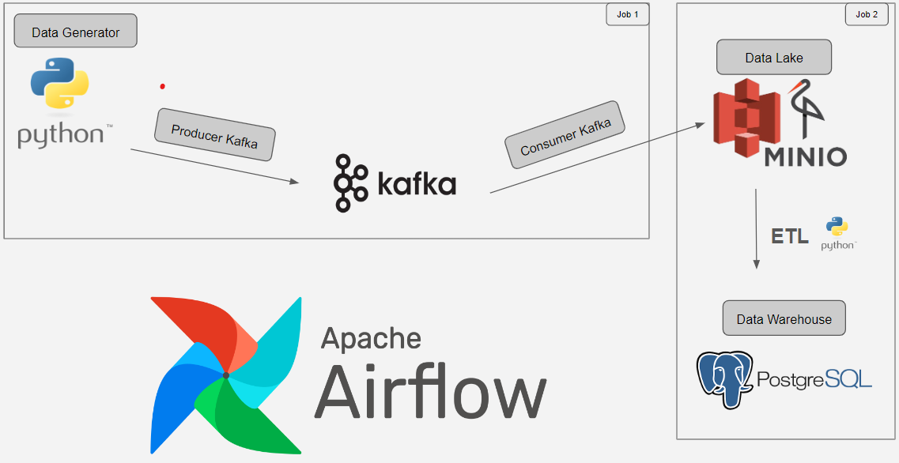

## Contexte :
Ce projet constitue une pipeline de données produites avec un générateur basé sur un script python, transitant via une queue kafka (Producuer + Consumer) et qui se déversent dans un datalake MinIO (hdfs compatible avec AWS S3). Ensuite les données sont récupérées à des fréquences régulières et inscrites dans un data warehouse (base de données postgres).

Tout le fonctionnement étant orchestré avec Airflow.

## les 3 services lancés via le docker-compose sont :
 - Kafka : service de queue messaging permettant le streaming de la donnée
 - Zookeeper : utilisé pour gèrer la distribution du système kafka
 - MinIO : est un sytème de fichiers distribué, open source, compatible avec AWS S3

## Comment exécuter le projet ?
Pour lancer le service airflow (installé en standalone), il faut executer successivement les scripts bash suivants : 
 - airflow_install.sh
 - airflow_run.sh

Il faudra bien s'assurer avant de lancer airflow d'avoir bien lancé les 3 services (conteneurs docker) précédants : 
 - docker-compose up -d

## Détails de jobs airflow : 
 - customers_producer_&_consumer : dag de génération du flux de données et chargement dans MinIO
 - load_data_from_s3_to_psql : dag de chargement des données à partir du datalake dans MinIO pour alimenter une base de données psql

## Architecture de la pipeline : 

